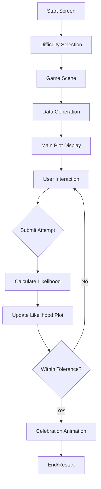

# Likelihood Game - Implementation Plan

## Project Overview
An interactive educational game where users fit a linear regression line to data by adjusting parameters to maximize likelihood. Built with Phaser.js for GitHub Pages deployment.

## Architecture Overview



## Technical Stack
- **Framework**: Phaser.js 3.x (via CDN)
- **Deployment**: GitHub Pages
- **Structure**: Single HTML file with embedded JavaScript (or index.html + game.js)
- **Audio**: Web Audio API or Phaser sound system
- **Graphics**: Phaser Graphics API for plots and animations

## Detailed Implementation Steps

### 1. Project Structure Setup
**Files:**
- `index.html` - Main game file
- `game.js` (optional) - Game logic if separating concerns
- `assets/` (optional) - Audio files and guinea pig sprites

**Decision**: Start with single HTML file, split to separate JS if code exceeds ~500 lines.

### 2. Phaser.js Integration
```html
<script src="https://cdn.jsdelivr.net/npm/phaser@3/dist/phaser.min.js"></script>
```

**Scenes to implement:**
- `StartScene` - Title and instructions
- `DifficultyScene` - Difficulty selection
- `GameScene` - Main gameplay
- `CelebrationScene` - Success animation

### 3. Difficulty Selection Implementation

**Parameters by difficulty:**

| Difficulty | β₀ | β₁ | σ | n | Tolerance |
|------------|----|----|---|---|-----------|
| Easy | 5 | 2.0 | 2.0 | 30 | 0.95 |
| Medium | 5 | 1.5 | 4.0 | 30 | 0.98 |
| Hard | 5 | 1.0 | 6.0 | 30 | 0.99 |

**Tolerance**: User must achieve log-likelihood ≥ tolerance × max_log_likelihood

**UI Elements:**
- Three buttons with visual indicators
- Brief description of each difficulty
- Audio feedback on selection

### 4. Data Generation Module

**Mathematical Model:**
```
y_i = β₀ + β₁ × x_i + ε_i
where ε_i ~ N(0, σ²)
```

**Implementation:**
```javascript
class DataGenerator {
  constructor(seed = null) {
    this.rng = seed ? new SeededRNG(seed) : Math.random;
  }
  
  generate(n, beta0, beta1, sigma) {
    const x = Array.from({length: n}, (_, i) => i / (n-1) * 10);
    const y = x.map(xi => 
      beta0 + beta1 * xi + this.normalRandom(0, sigma)
    );
    return {x, y};
  }
  
  normalRandom(mean, std) {
    // Box-Muller transform
  }
}
```

**Features:**
- Seeded RNG for testing (use seed parameter in URL: `?seed=12345`)
- x values evenly spaced in [0, 10]
- Gaussian noise via Box-Muller transform

### 5. MLE Reference Calculation

**Closed-form OLS estimates:**
```javascript
class MLECalculator {
  static computeOLS(x, y) {
    const n = x.length;
    const meanX = x.reduce((a,b) => a+b) / n;
    const meanY = y.reduce((a,b) => a+b) / n;
    
    let numerator = 0, denominator = 0;
    for (let i = 0; i < n; i++) {
      numerator += (x[i] - meanX) * (y[i] - meanY);
      denominator += (x[i] - meanX) ** 2;
    }
    
    const beta1_hat = numerator / denominator;
    const beta0_hat = meanY - beta1_hat * meanX;
    
    // Compute sigma^2 from residuals
    const residuals = y.map((yi, i) => 
      yi - beta0_hat - beta1_hat * x[i]
    );
    const sigma2_hat = residuals.reduce((sum, r) => 
      sum + r**2, 0
    ) / n;
    
    return {beta0_hat, beta1_hat, sigma2_hat};
  }
}
```

### 6. Likelihood Calculation

**Log-likelihood formula:**
```
log L = -n/2 × log(2πσ²) - 1/(2σ²) × Σ(y_i - β₀ - β₁x_i)²
```

**Implementation decision:**
- **Option A (Recommended)**: Use estimated σ² from current residuals
  - More accurate MLE
  - User optimizes both line fit and variance
  
- **Option B**: Use fixed σ² from true data generation
  - Simpler for players
  - Focuses only on β₀ and β₁

**Recommendation**: Use Option A with σ² estimated from residuals for each attempt.

```javascript
class LikelihoodCalculator {
  static logLikelihood(x, y, beta0, beta1) {
    const n = x.length;
    const residuals = y.map((yi, i) => 
      yi - beta0 - beta1 * x[i]
    );
    const sumSquaredResiduals = residuals.reduce((sum, r) => 
      sum + r**2, 0
    );
    const sigma2 = sumSquaredResiduals / n;
    
    const logL = -n/2 * Math.log(2 * Math.PI * sigma2) 
                 - sumSquaredResiduals / (2 * sigma2);
    
    return logL;
  }
}
```

### 7. Game UI Layout

**Canvas dimensions**: 1200 × 800 pixels

**Layout:**
```
┌─────────────────────────────────────────────────┐
│  Likelihood Game - [Difficulty]                │
├──────────────────────┬──────────────────────────┤
│                      │  Controls Panel          │
│   Main Scatter Plot  │  β₀: [value]            │
│   (600×500)          │  β₁: [value]            │
│                      │  Log-L: [value]         │
│   • Data points      │  Max Log-L: [value]     │
│   • Draggable line   │  Progress: [bar]        │
│   • Handles          │  [Submit Button]        │
│                      │  Attempts: [count]      │
├──────────────────────┼──────────────────────────┤
│  Likelihood History  │  Instructions           │
│  Plot (600×250)      │  • Drag handles         │
│                      │  • Submit to record     │
└──────────────────────┴──────────────────────────┘
```

### 8. Main Scatter Plot Implementation

**Features:**
- Axes with labels and tick marks
- Data points rendered as circles
- Regression line overlay
- Two draggable handles:
  - **Intercept handle**: Moves line vertically (changes β₀)
  - **Slope handle**: Rotates line around center (changes β₁)

**Phaser implementation:**
```javascript
class ScatterPlot {
  constructor(scene, x, y, width, height) {
    this.graphics = scene.add.graphics();
    this.drawAxes();
    this.plotData(data);
    this.createDraggableHandles();
  }
  
  drawAxes() {
    // Draw x and y axes with labels
  }
  
  plotData(data) {
    // Render data points as circles
  }
  
  updateLine(beta0, beta1) {
    // Redraw regression line
  }
  
  createDraggableHandles() {
    // Create interactive sprites for intercept and slope
  }
}
```

### 9. Draggable Line Interaction

**Handle types:**
1. **Intercept handle** (circle at y-intercept on y-axis)
   - Drag vertically to change β₀
   - Visual: Blue circle
   
2. **Slope handle** (circle at right edge of plot)
   - Drag vertically to change β₁
   - Visual: Red circle

**Interaction logic:**
```javascript
class LineController {
  constructor(plot) {
    this.beta0 = 0;
    this.beta1 = 0;
    this.setupHandles();
  }
  
  setupHandles() {
    this.interceptHandle.on('drag', (pointer, dragX, dragY) => {
      this.beta0 = this.screenToDataY(dragY);
      this.updateLine();
    });
    
    this.slopeHandle.on('drag', (pointer, dragX, dragY) => {
      const y = this.screenToDataY(dragY);
      const x = this.maxX;
      this.beta1 = (y - this.beta0) / x;
      this.updateLine();
    });
  }
}
```

### 10. Side Panel UI

**Display elements:**
- Current parameter values (formatted to 2 decimal places)
- Current log-likelihood
- Maximum possible log-likelihood (from OLS)
- Progress bar showing closeness to target
- Submit button
- Attempt counter

**Styling:**
- Use Phaser text objects
- Color-coded progress bar (red → yellow → green)
- Highlight improvements in green

### 11. Likelihood History Plot

**Features:**
- X-axis: Attempt number
- Y-axis: Log-likelihood value
- Horizontal line showing maximum log-likelihood
- Points connected by lines
- Color gradient showing improvement

**Implementation:**
```javascript
class LikelihoodPlot {
  constructor(scene, x, y, width, height) {
    this.attempts = [];
    this.maxLogL = null;
  }
  
  addAttempt(logL) {
    this.attempts.push(logL);
    this.redraw();
  }
  
  redraw() {
    // Clear and redraw all points and lines
    // Highlight best attempt
  }
}
```

### 12. Submit Button Functionality

**On submit:**
1. Calculate log-likelihood for current β₀, β₁
2. Add to attempts array
3. Update likelihood history plot
4. Play audio feedback
5. Check if within tolerance
6. If success, trigger celebration
7. Update UI with new values

**Audio feedback:**
- Submit sound: Short click/beep
- Improvement sound: Positive chime
- Success sound: Triumphant fanfare

### 13. Progress Tracking

**Metrics:**
- Current log-likelihood
- Maximum log-likelihood (from OLS)
- Ratio: current / maximum
- Distance from target: |current - maximum|

**Success condition:**
```javascript
const ratio = currentLogL / maxLogL;
const success = ratio >= tolerance;
```

**Visual feedback:**
- Progress bar fills as ratio approaches 1.0
- Color changes: red (< 0.8) → yellow (0.8-0.95) → green (> 0.95)
- Percentage display

### 14. Audio Integration

**Sound generation using Web Audio API:**
- No external audio files needed
- Generate tones programmatically
- Lightweight and always available

**Implementation:**
```javascript
class AudioManager {
  constructor() {
    this.audioContext = new (window.AudioContext || window.webkitAudioContext)();
  }
  
  playTone(frequency, duration, type = 'sine') {
    const oscillator = this.audioContext.createOscillator();
    const gainNode = this.audioContext.createGain();
    
    oscillator.connect(gainNode);
    gainNode.connect(this.audioContext.destination);
    
    oscillator.frequency.value = frequency;
    oscillator.type = type;
    
    gainNode.gain.setValueAtTime(0.3, this.audioContext.currentTime);
    gainNode.gain.exponentialRampToValueAtTime(0.01, this.audioContext.currentTime + duration);
    
    oscillator.start(this.audioContext.currentTime);
    oscillator.stop(this.audioContext.currentTime + duration);
  }
  
  playSubmit() {
    this.playTone(440, 0.1, 'sine'); // A4 note, short beep
  }
  
  playImprove() {
    // Ascending arpeggio
    this.playTone(523, 0.1, 'sine'); // C5
    setTimeout(() => this.playTone(659, 0.1, 'sine'), 100); // E5
  }
  
  playSuccess() {
    // Victory fanfare
    this.playTone(523, 0.15, 'square'); // C5
    setTimeout(() => this.playTone(659, 0.15, 'square'), 150); // E5
    setTimeout(() => this.playTone(784, 0.3, 'square'), 300); // G5
  }
}
```

**Benefits:**
- Zero external dependencies
- Instant loading
- Customizable tones
- Works on all modern browsers

### 15. Celebration Animation

**Guinea pig animation:**
1. Data points transform into guinea pig sprites
2. Guinea pigs bounce around screen with physics
3. Confetti particles fall
4. Success message displays
5. Option to restart or change difficulty

**Phaser implementation:**
```javascript
class CelebrationScene extends Phaser.Scene {
  create(data) {
    // Convert data points to guinea pigs
    data.points.forEach(point => {
      const guineaPig = this.physics.add.sprite(point.x, point.y, 'guineapig');
      guineaPig.setVelocity(
        Phaser.Math.Between(-200, 200),
        Phaser.Math.Between(-300, -100)
      );
      guineaPig.setBounce(0.8);
      guineaPig.setCollideWorldBounds(true);
    });
    
    // Add confetti
    this.createConfetti();
    
    // Display success message
    this.showSuccessMessage(data.attempts);
  }
}
```

**Guinea pig sprite**: Simple pixel art or emoji-based sprite (🐹)

### 16. Testing Strategy

**Likelihood calculation validation:**
1. Generate data with known parameters
2. Verify OLS estimates match expected values
3. Confirm log-likelihood is maximized at OLS estimates
4. Test edge cases (perfect fit, no relationship)

**Test cases:**
```javascript
// Test 1: Perfect fit (σ = 0)
// Expected: logL should be very high

// Test 2: No relationship (β₁ = 0, high σ)
// Expected: logL should be low

// Test 3: Known parameters
// Expected: OLS should recover true β₀, β₁
```

### 17. GitHub Pages Optimization

**Requirements:**
- All assets must be inline or CDN-hosted
- No server-side processing
- Fast load time
- Mobile-friendly

**Optimizations:**
- Minify JavaScript if using separate file
- Use CDN for Phaser.js
- Inline small audio files as base64 (if needed)
- Compress guinea pig sprites
- Add loading screen for assets

**File structure for GitHub Pages:**
```
/
├── index.html
├── game.js (optional)
└── assets/
    ├── sounds/
    │   ├── submit.mp3
    │   ├── improve.mp3
    │   └── success.mp3
    └── sprites/
        └── guineapig.png
```

### 18. Responsive Design

**Breakpoints:**
- Desktop: 1200×800 (default)
- Tablet: 800×600 (scaled)
- Mobile: 400×600 (vertical layout)

**Phaser scaling:**
```javascript
const config = {
  type: Phaser.AUTO,
  scale: {
    mode: Phaser.Scale.FIT,
    autoCenter: Phaser.Scale.CENTER_BOTH,
    width: 1200,
    height: 800
  }
};
```

### 19. Documentation

**In-game instructions:**
- Brief tutorial on first load
- Tooltips on hover
- Help button with detailed explanation

**README additions:**
- How to play
- Mathematical background
- Difficulty explanations
- Development notes

### 20. Additional Features (Optional Enhancements)

**Nice-to-have features:**
- Leaderboard (attempts to success)
- Multiple datasets
- Custom difficulty settings
- Export results as CSV
- Share score on social media
- Dark mode toggle

## Implementation Order

**Phase 1: Core Functionality**
1. Set up HTML structure with Phaser
2. Implement data generation
3. Create main scatter plot
4. Add draggable line controls
5. Implement likelihood calculations
6. Add submit functionality

**Phase 2: UI and Feedback**
7. Build side panel UI
8. Create likelihood history plot
9. Add progress tracking
10. Implement difficulty selection

**Phase 3: Polish**
11. Add audio feedback
12. Create celebration animation
13. Test likelihood accuracy
14. Optimize for GitHub Pages
15. Add responsive design

**Phase 4: Documentation**
16. Write in-game instructions
17. Update README
18. Add code comments

## Key Design Decisions

### Decision 1: σ² Estimation
**Choice**: Estimate σ² from residuals for each attempt
**Rationale**: More mathematically accurate, teaches complete MLE concept

### Decision 2: File Structure
**Choice**: Start with single HTML file
**Rationale**: Simpler deployment, meets constraint, can split later if needed

### Decision 3: Handle Interaction
**Choice**: Two separate handles (intercept and slope)
**Rationale**: More intuitive than single handle, clearer parameter control

### Decision 4: Success Metric
**Choice**: Ratio-based tolerance (current/max ≥ threshold)
**Rationale**: Scales across difficulties, percentage-based is intuitive

### Decision 5: Guinea Pig Sprites
**Choice**: Simple emoji or pixel art
**Rationale**: Lightweight, fun, easy to implement without artist

## Mathematical Accuracy Checklist

- [ ] Box-Muller transform correctly implements N(0,1)
- [ ] OLS formulas match standard derivation
- [ ] Log-likelihood formula includes all terms
- [ ] σ² estimation uses correct degrees of freedom (n vs n-2)
- [ ] Numerical stability for extreme parameter values
- [ ] Tolerance thresholds are achievable

## Performance Considerations

- Redraw plots only on parameter change, not every frame
- Use object pooling for particles in celebration
- Limit history plot to last 50 attempts
- Debounce drag events if performance issues arise

## Accessibility

- Keyboard controls for handle adjustment
- Screen reader labels for UI elements
- High contrast mode option
- Audio toggle for sound effects

---

## Next Steps

After reviewing this plan, proceed to implementation in Code mode following the phase order outlined above.
